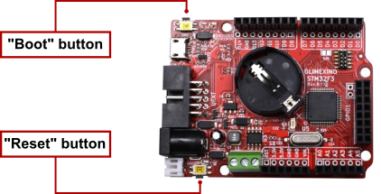
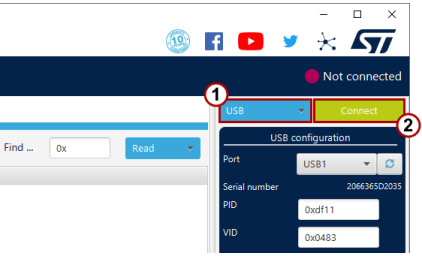
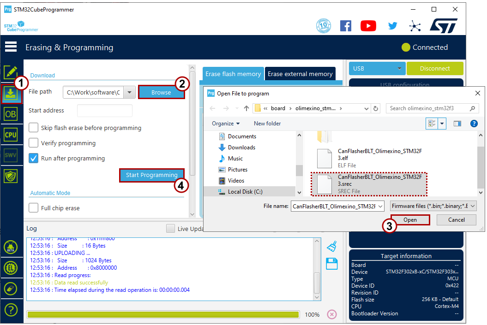
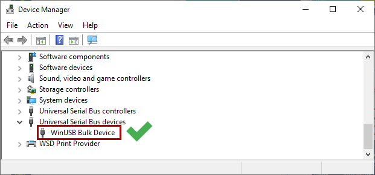
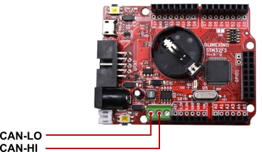
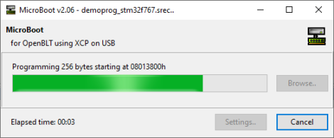
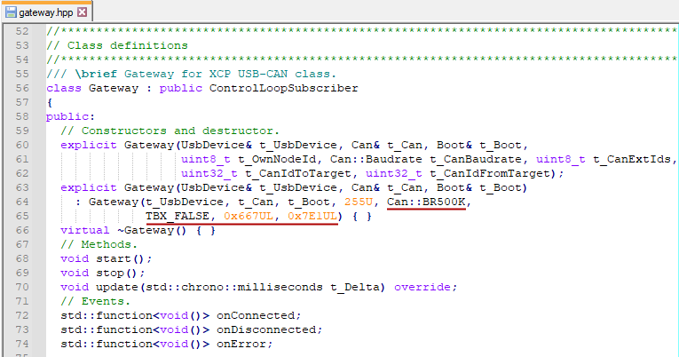

# Getting started

This section focuses on getting your Olimexino STM32F3 board prepared, such that it serves its purpose as a CanFlasherBLT device. You'll need the following items:

* An Olimex [Olimexino STM3F3](https://www.olimex.com/Products/Duino/STM32/OLIMEXINO-STM32F3/) board. 
* A [USB cable](https://www.olimex.com/Products/Components/Cables/USB-CABLE-A-MICRO-1.8M/) for connecting the board to your PC.
* The [STM32CubeProgrammer](https://www.st.com/en/development-tools/stm32cubeprog.html) tool installed on your PC.

Regarding the board, make sure you order the Olimexino STM32F3 type. Not the Olimexino GD32F3 and also not the older Olimexino STM32. It needs to be the one with the STM32F303RCT6 microcontroller.

## Download the prebuilt firmware image

As a first step, head over to the [Releases section](https://github.com/feaser/canflasherblt/releases) of the project's GitHub repository and download the prebuilt binary of the latest release. It's this file:

*  `CanFlasherBLT_Olimexino_STM32F3.srec` 

## Flash the firmware image

Perform the following steps to flash the previously downloaded prebuilt firmware file into the flash memory of the on-board STM32F303RCT6 microcontroller:

* Connect the USB cable to the Olimexino STM32F3 board and insert the other end of the USB cable into a USB slot of your PC.
* While keeping the "Boot"-button pressed, briefly press the "Reset"-button. This activates the STM32F3's internal USB bootloader:

* Start the STM32CubeProgrammer tool on your PC. Select USB mode from the dropdown list (1), followed by clicking the "Connect"-button (2):

* Go to the "Erase and Programming" section (1), click the "Browse"-button (2), select the `CanFlasherBLT_Olimexino_STM32F3.srec`  file (3) and click the "Start Programming"-button (4):

* To complete the firmware programming, close the STM32CubeProgrammer tool and briefly press the "Reset"-button on the board one more time. 

## Check in the device manager

As a quick verification of the CanFlasherBLT firmware programming, open up the Device Manager in Windows. Check that you see an entry called "WinUSB Bulk Device":

If it doesn't show up, try removing the USB cable from your PC and plug it back in afterwards.

## Reconfigure MicroBoot or BootCommander

In the MicroBoot settings, change "XCP on CAN" to "XCP on USB". During the next firmware update, MicroBoot will talk to the CanFlasherBLT device and thinks it is updating that one via USB. While in fact, the CanFlasherBLT firmware is passing all XCP requests and response packets to and from the CAN bus:

The same method works for the command-line BootCommander tool. In this case you would just use the `-t=xcp_usb` parameter, instead of `-t=xcp_can`.

## Start the firmware update

To try out a firmware update using the CanFlasherBLT device, connect it to the CAN bus. This assumes the presence of another CAN node that runs the OpenBLT bootloader and on which you would like to perform a firmware update.

The Olimexino STM32F3 board features an on-board CAN transceiver. All you have to do is connect the CAN-HI and CAN-LO connector pins on the board to your CAN bus:

Next, start the firmware update as usual with MicroBoot (or BootCommander):

## Changing CAN communication settings

As mentioned in the [introduction](index.md), one shortcoming of the CanFlasherBLT solution is that you can no longer specify the CAN communication settings from within MicroBoot / BootCommander. It always uses these default settings:

* CAN baudrate: 500 kbits/sec.
* CAN transmit identifier: 667h (11-bit)
* CAN receive identifier: 7E1h (11-bit)

You can still change these CAN communication settings. The only downside is that you need to change this inside the CanFlasherBLT source code. Afterwards, you need to rebuild the CanFlasherBLT image from source code and flash it again on the Olimexino STM32F3 board. Refer to the [Building](building.md) section for detailed instructions on how to rebuilt the CanFlasherBLT image from source code. 

One way of changing the CAN communication settings is by editing the `source\gateway.hpp` file and changing the values in one of the `Gateway` class constructors:

