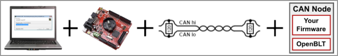
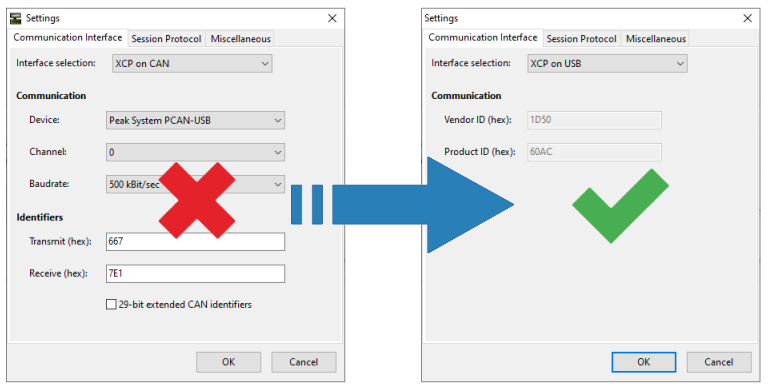

# Introduction to CanFlasherBLT

Using the OpenBLT bootloader for updating the firmware on your microcontroller via a Controller Area Network (CAN) bus? Wouldn't it be great if you and your customers could use a dedicated low-cost USB-CAN PC adapter, instead of a conventional (read: much more expensive) USB-CAN PC adapter? Then look no further: CanFlasherBLT is here.

CanFlasherBLT consist of ready-made firmware for the low-cost ($15-$20) [Olimexino-STM32F3](https://www.olimex.com/Products/Duino/STM32/OLIMEXINO-STM32F3/) board. You simply connect one side of the Olimexino-STM32F3 board to your PC with a USB cable, and the other side to your CAN bus. You can then use the usual OpenBLT PC tools such as [MicroBoot](https://www.feaser.com/openblt/doku.php?id=manual:microboot) and [BootCommander](https://www.feaser.com/openblt/doku.php?id=manual:bootcommander) to perform a firmware update, assuming that your microcontroller runs the OpenBLT bootloader on your microcontroller,

## How it works

The OpenBLT bootloader communicates using the [XCP protocol](https://www.feaser.com/openblt/doku.php?id=manual:design#communication_sequence) during a firmware update. An ideal communication protocol not only for data acquisition and calibration, but also for bootloader purposes. Under the hood, CanFlasherBLT essentially implements a USB to CAN gateway for the XCP protocol:

From an end-user perspective, you simply reconfigure the OpenBLT PC tools for firmware updates via USB, instead of CAN. This means that during the firmware update, the PC thinks it's talking via USB with OpenBLT on the microcontroller. CanFlasherBLT translates all USB XCP packets to CAN XCP packets unidirectionally. 

In contrast to a conventional USB-CAN PC adapter, CanFlasherBLT supports automatic USB driver installation on Windows 10 and higher. Making it even more user-friendly for the end-user. Note that CanFlasherBLT works on [Linux ](https://www.feaser.com/openblt/doku.php?id=manual:demos:usb_driver_install#usb_driver_installation_on_linux) as well.

## Known limitations

By design, CanFlasherBLT has two known limitations:

1. Is it not a fully functional USB-CAN PC adapter. It's merely a USB-CAN XCP gateway used for the sole purpose for performing firmware updates on CAN-nodes running the OpenBLT bootloader.
2. As shown in the previous illustration, you can no longer configure the CAN baudrate and CAN identifiers in MicroBoot, once you select `XCP on USB`. The configuration values are not hardcoded into the CanFlasherBLT firmware. You can of course change them, but it involves rebuilding and reflashing the CanFlasherBLT firmware.

## Try it out

If you'd like to take CanFlasherBLT for a spin, continue reading in the [getting started](gettingstarted.md) section. 

Curious about the CanFlasherBLT source code? You can find it in the project's [GitHub repository](https://github.com/feaser/canflasherblt). It's MIT licensed, meaning that you can pretty much do whatever you want with it. As long as you leave the copyright and permission notice in tact. The source code contains a clear abstraction layer for all the board specifics. This makes it fairly straightforward to port it to different hardware.

